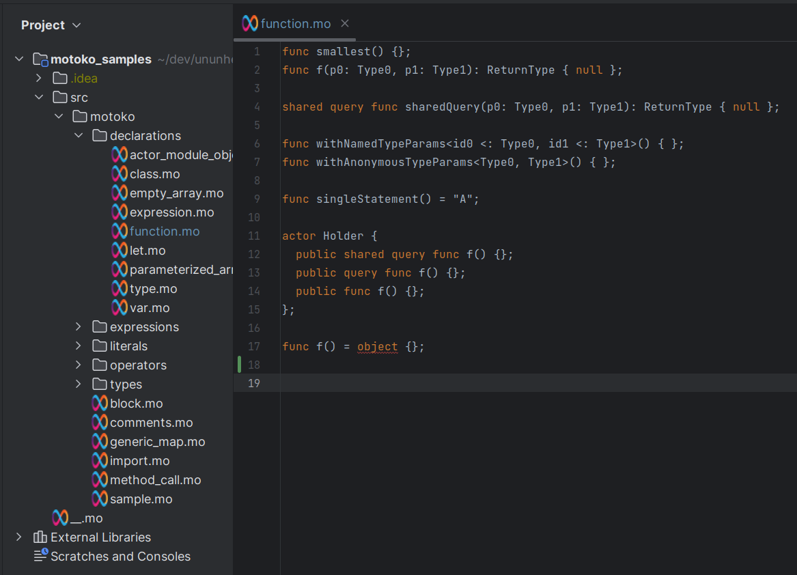

# Motoko plugin for IntelliJ IDEA

Adds support for the Motoko language from Dfinity.

## IDE Dev Setup

1. Install Grammar-Kit from Jetbrains 
1. Right click `src/main/java/net/lab0/motoko/Motoko.bnf` and click `Generate Parser Code`
1. Right click `src/main/java/net/lab0/motoko/Motoko.flex` and click `Run JFlex Generator`, select the `src/main/gen`
folder and click `Ok`.
1. Mark `src/main/gen` as Generated Sources Root
1. Compile with `./gradlew buildPlugin`
1. Start IJ with `./gradlew runIde`
1. Open `motoko_samples` as a project folder.

Basic parsing and syntax coloring is now available.

## Status

Toy project. Abandoned. Using the Motoko LSP is a better option.

VS code has [an extension](https://marketplace.visualstudio.com/items?itemName=dfinity-foundation.vscode-motoko) for this.

## Features

Parses almost all the Motoko grammar from early 2021.

Motoko is the language used by the [Internet Computer](https://dfinity.org/), a crypto decentralized datacenter project.
